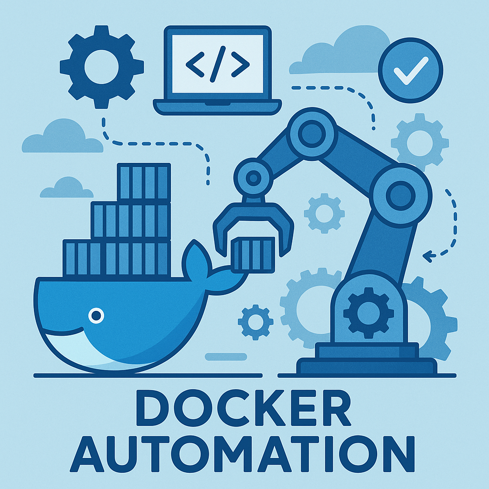

## Docker Automation

The project aims to automate Docker container management tasks using Interface. Docker is a popular platform for containerization, enabling developers to package applications and their dependencies into isolated containers. Automation of Docker tasks can streamline development workflows, improve efficiency, and ensure consistency across environments.

## Technologies Used

- ReactJS, ExpressJS, NodeJS, DockerSDK

---

## Prerequisites

Before installing, make sure you have the following tools installed on your system:

| Requirement | Version | Installation |
|-------------|---------|--------------|
| **Node.js** | v18 or later | [nodejs.org](https://nodejs.org/) |
| **npm** | v8 or later (included with Node.js) | Comes with Node.js |
| **Docker** | Latest stable | See [Docker Setup](#docker-setup) below |
| **Git** | Any recent version | [git-scm.com](https://git-scm.com/) |

Verify your installations:

```bash
node -v
npm -v
docker --version
git --version
```

---

## Docker Setup

Docker must be installed and **running** on your machine since the application communicates with the Docker daemon.

### Linux

```bash
# Install Docker
sudo apt-get update
sudo apt-get install -y docker.io

# Start and enable the Docker service
sudo systemctl start docker
sudo systemctl enable docker

# Add your user to the docker group (so you can run Docker without sudo)
sudo usermod -aG docker $USER

# Log out and log back in for the group change to take effect
```

### macOS

1. Download and install [Docker Desktop for Mac](https://www.docker.com/products/docker-desktop/).
2. Open Docker Desktop and wait for it to start (the whale icon in the menu bar should be steady).

### Windows

1. Download and install [Docker Desktop for Windows](https://www.docker.com/products/docker-desktop/).
2. During installation, enable **WSL 2** backend if prompted.
3. Open Docker Desktop and wait for it to start (the whale icon in the system tray should be steady).

Verify Docker is running:

```bash
docker info
```

---

## Installation

### 1. Clone the Repository

```bash
git clone https://github.com/Harihkvent/Docker-Automation.git
cd Docker-Automation
```

### 2. Install Server Dependencies

```bash
cd server
npm install
```

### 3. Configure Server Environment

```bash
cp .env.example .env
```

The default `.env` contains:

```env
PORT=5000
NODE_ENV=production
```

Adjust the values if needed.

### 4. Build the Server

The server is written in TypeScript and must be compiled before running:

```bash
npm run build
```

### 5. Install Client Dependencies

```bash
cd ../client
npm install
```

### 6. Configure Client Environment

```bash
cp .env.example .env
```

For local development, create or edit `.env` with:

```env
REACT_APP_API_URL=http://localhost:5000
```

---

## Running the Application

You need **two terminal windows** — one for the server and one for the client.

### Terminal 1 — Start the Server

```bash
cd server
node dist/index.js
```

The server starts on `http://localhost:5000`.

### Terminal 2 — Start the Client

```bash
cd client
npm start
```

The React development server starts on `http://localhost:3000`.

### Access the Application

Open your web browser and navigate to **http://localhost:3000**. The client will communicate with the backend server which in turn manages your Docker containers.

---

## Usage

Once the application is running, you can:

- **List Containers** — View all Docker containers (running and stopped) on your system.
- **Start / Stop Containers** — Control container lifecycle from the UI.
- **Remove Containers** — Delete stopped containers.
- **Pull Images** — Pull Docker images from Docker Hub.
- **View Container Logs** — Inspect stdout/stderr output of any container.

> **Note:** Make sure Docker is running before performing any operations. The backend connects to Docker through `/var/run/docker.sock` (Linux/macOS) or the Docker Desktop named pipe (Windows).

---

## Workflow Design


---

## Desktop App

Docker Automation can also run as a standalone desktop application on Linux and Windows using Electron. See the **[Desktop App Guide](DESKTOP_APP.md)** for installation and packaging instructions.

## Deployment

For deploying the application to cloud platforms (Railway, Render, DigitalOcean, VPS), see the **[Deployment Guide](DEPLOYMENT.md)**.

---

## Troubleshooting

| Problem | Solution |
|---------|----------|
| **`docker: Cannot connect to the Docker daemon`** | Make sure Docker is installed and running. On Linux, verify your user is in the `docker` group. |
| **Server crashes on start** | Ensure you ran `npm run build` inside the `server/` directory first. The compiled files must exist in `server/dist/`. |
| **Client shows network errors** | Confirm the server is running on port 5000 and that `REACT_APP_API_URL` in `client/.env` is set to `http://localhost:5000`. |
| **Port 5000 already in use** | Stop the other process using port 5000, or change the `PORT` value in `server/.env` and update `REACT_APP_API_URL` accordingly. |
| **Port 3000 already in use** | The React dev server will prompt you to use another port. Press `Y` to accept. |

---

## Additional Notes

- We welcome contributions of all forms, whether it's through code contributions, bug reports, feature suggestions, documentation improvements, or even sharing your experiences and ideas.


